<style>
@page { size: A4; margin: 2.5cm; }
body {
  font-family: "Times New Roman", Times, serif;
  font-size: 12pt;
  line-height: 1.35;
  text-align: justify;
  color: #000000;
}
h1, h2, h3, h4 {
  font-family: "Times New Roman", Times, serif;
  color: #000000;
}
h2 { margin-top: 1.6em; page-break-after: avoid; }
p, figcaption { font-family: "Times New Roman", Times, serif; }
a { color: #000000; }
.portada {
  text-align: center;
  margin-top: 70px;
  padding: 42px 28px;
  border-top: 2px solid #000000;
  border-bottom: 2px solid #000000;
}
table {
  width: 100%;
  border-collapse: collapse;
  font-family: "Times New Roman", Times, serif;
  font-size: 10.5pt;
  page-break-inside: avoid;
  box-shadow: 0 0 0 1px #8a9baa;
}
th, td { padding: 7px 9px; border: 1px solid #aab7c4; }
th { background: #dce6ef; color: #000000; }
tr:nth-child(even) { background: #f4f7fa; }
img { page-break-inside: avoid; }
code { font-size: 0.92em; }
</style>

<div class="portada">

# Universidad Nacional de Colombia
## Asignatura: Minería de Datos

<br>

# Taller 3
## Identificación de beneficiarios asociados a dorsalgia mediante modelos predictivos

<br>

**Nombre:** Luisa Fernanda Guerrero Ordoñez  
**Grupo:** 1  
**Enfermedad seleccionada:** Dorsalgia  
**Código CID:** M54  
**Julio de 2026**

</div>

<div style="page-break-before: always;"></div>

## 1. Introducción

Este trabajo usa una base real de servicios de salud para identificar beneficiarios asociados a dorsalgia. La información está organizada por atenciones y procedimientos, por lo que una misma persona puede aparecer en muchas filas. Para hacer el análisis fue necesario resumir esos registros y construir una base con una fila por beneficiario.

La condición seleccionada fue dorsalgia, representada por la familia CID M54. A partir de ese código se creó una etiqueta que indica si cada persona tuvo o no un registro relacionado con la enfermedad. Luego se compararon modelos de clasificación y se estudiaron los costos de las atenciones M54.

El trabajo reúne las etapas de preparación, descripción, construcción de variables, modelamiento, evaluación, interpretación y costos. Los resultados muestran relaciones presentes en esta base. No se puede afirmar causalidad con estos datos ni usar el modelo como una herramienta clínica automática.

## 2. Comprensión del problema

`CHAVE_FUNCIONAL` identifica a cada beneficiario y `DT_UTILIZACAO` registra la fecha de atención. Una consulta puede incluir varios procedimientos. Si cada fila se contara como una consulta diferente, el uso de servicios quedaría sobreestimado. Por eso una utilización se aproximó mediante la combinación beneficiario-fecha.

El problema se planteó como una clasificación binaria por beneficiario. La etiqueta toma el valor 1 cuando la persona tiene al menos un CID M54 y 0 en caso contrario. El CID se retiró de las variables predictoras para evitar fuga de información, es decir, para impedir que el modelo aprendiera directamente la respuesta. `CHAVE_FUNCIONAL` también se retiró porque solo funciona como identificador.

La clase positiva fue extremadamente rara. Esto hace que accuracy sea poco informativa: un modelo que clasificara a todas las personas como negativas tendría una accuracy cercana a 99,9 %, aunque no encontraría ningún caso. Por esta razón se dio mayor peso a PR-AUC, sensibilidad y F1.

## 3. Descripción de la base de datos

Se procesaron **9.345.278 registros**, correspondientes a **653.631 beneficiarios**. Se estimaron **2.250.307 utilizaciones** mediante beneficiario-fecha. Todos los registros contenían código de procedimiento y se encontraron **3.252 códigos de procedimiento distintos**.

La base incluye diagnóstico, internación, UCI, fechas, especialidad, unidad hospitalaria, estado, datos demográficos, tipo de atención, procedimiento y costo. `CID` representa el diagnóstico. `CD_PROCEDIMENTO`, en cambio, identifica el procedimiento realizado y se relaciona con la Terminología Unificada de Salud Suplementaria (TUSS) y las tablas de la Agência Nacional de Saúde Suplementar (ANS).

<div style="text-align:center;">
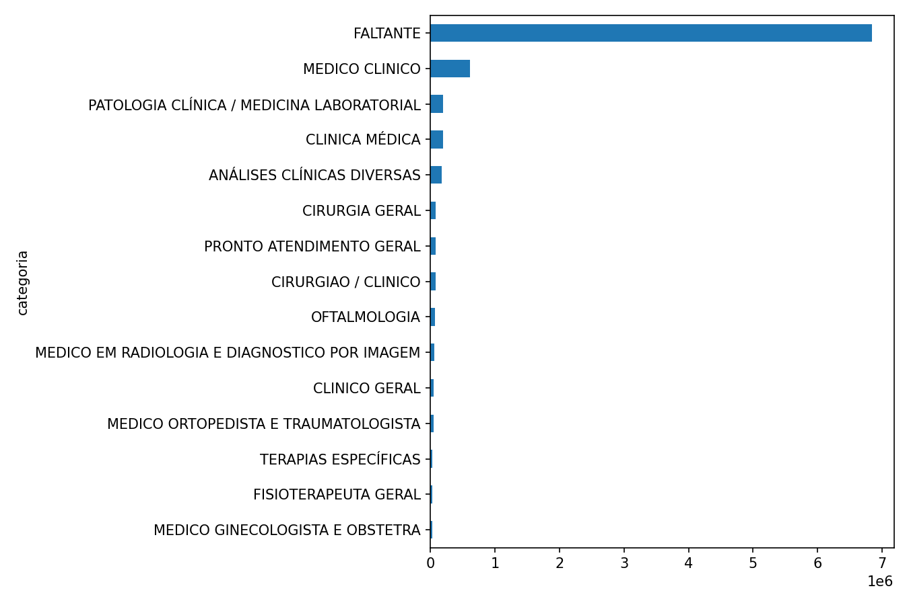

*Figura 1. Especialidades con mayor número de registros.*
</div>

La atención se concentra en pocas especialidades. Esto ayuda a entender por qué la especialidad aparece después entre las variables importantes. Sin embargo, una especialidad muy frecuente también tiene más oportunidades de quedar asociada con cualquier diagnóstico, así que este resultado debe leerse con cuidado.

<div style="page-break-before: always;"></div>

## 4. Enfermedad seleccionada y construcción de la variable objetivo

La dorsalgia se definió mediante la familia M54. El código se validó con el navegador ICD-10 de la Organización Mundial de la Salud. Se aceptaron formatos con y sin punto, por ejemplo M54, M545, M549, M54.2 y M54.5.

La variable objetivo se construyó así:

- `dorsalgia = 1`: el beneficiario tuvo al menos una transacción cuyo CID comienza por `M54`.
- `dorsalgia = 0`: no se observó ningún CID M54 para el beneficiario.

Se identificaron **633 beneficiarios positivos** y **652.998 negativos**, para una prevalencia observada de **0,0968 %**.

<div style="text-align:center;">
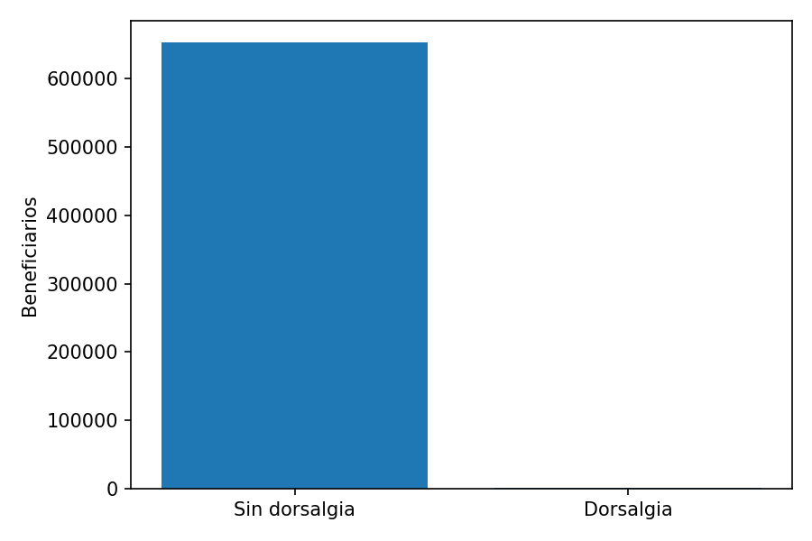

*Figura 2. Distribución de la variable objetivo a nivel de beneficiario.*
</div>

La diferencia entre clases es tan grande que la barra positiva casi desaparece. Esta cifra no representa necesariamente la prevalencia clínica de dorsalgia. Solo cuenta personas con M54 registrado, de modo que algunos casos pueden no estar incluidos porque el diagnóstico no quedó consignado.

## 5. Preparación de los datos

El archivo original supera 1,6 GB. Por esa razón se leyó en bloques de 250.000 filas, lo que permitió revisar y resumir más de nueve millones de registros sin cargar el CSV completo en memoria.

La preparación siguió reglas reproducibles:

1. Los textos se limpiaron quitando espacios, unificando mayúsculas y convirtiendo guiones, cadenas vacías y otros marcadores en faltantes.
2. El CID se normalizó sin retirar el punto, para conservar códigos como M54.5 y reconocer también M545 mediante el prefijo M54.
3. `DT_UTILIZACAO` y `DT_NASCIMENTO_BENEFICIARIO` se convirtieron a fecha; los valores inválidos pasaron a nulo.
4. `VALOR_UTILIZACAO` se convirtió a numérico contemplando coma y punto decimal.
5. Se calcularon faltantes, códigos CID inválidos, costos negativos, ceros y extremos.
6. Se buscaron beneficiarios con más de un sexo, nacimiento o tipo de beneficiario.
7. Para consolidar datos contradictorios se utilizó la moda por beneficiario; en empates se escogió el primer valor ordenado.
8. Las consultas se aproximaron por beneficiario-fecha y las variables finales se agregaron por `CHAVE_FUNCIONAL`.

Los scripts crean automáticamente `outputs/tablas`, `outputs/figuras` y `outputs/modelos`. Las auditorías, métricas y resúmenes se guardan como archivos CSV, mientras las gráficas se almacenan en formato PNG. Esto permite revisar cada resultado sin tener que ejecutar todo el proceso nuevamente.

## 6. Calidad de datos y decisiones de limpieza

<div style="text-align:center;">
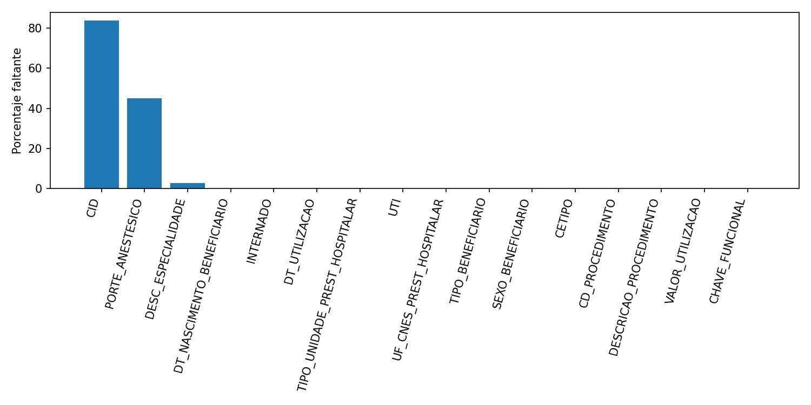

*Figura 3. Porcentaje de valores faltantes por variable.*
</div>

El principal problema fue CID: cerca de **83,7 %** de los registros no tenía un código utilizable. `PORTE_ANESTESICO` también presentó muchos faltantes. La ausencia de CID puede hacer que una persona con dorsalgia quede etiquetada como negativa simplemente porque el diagnóstico no fue registrado.

Se encontraron **525 beneficiarios con más de un sexo** y **6.950 con más de un tipo de beneficiario**. No se detectaron fechas de nacimiento contradictorias entre los valores válidos. Se usó la moda para escoger el valor más frecuente de cada persona. Esta regla permite construir una sola fila por beneficiario, aunque no corrige la inconsistencia en la fuente.

`VALOR_UTILIZACAO` no tuvo faltantes, aunque incluyó **70.394 ceros** y **3.001 valores negativos**. El promedio por registro fue 106,85, la desviación estándar 1.147,91 y el rango fue de -27.537,23 a 628.388,67.

<div style="text-align:center;">
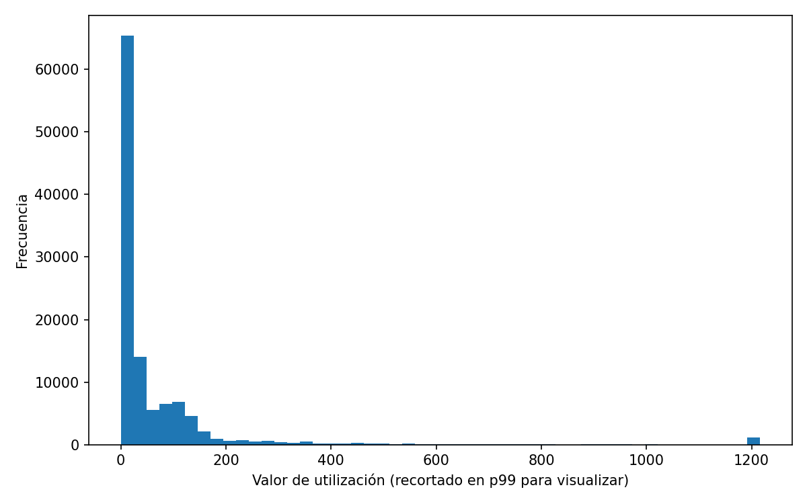

*Figura 4. Distribución de VALOR_UTILIZACAO, recortada en el percentil 99 para facilitar la lectura.*
</div>

La mayoría de los costos se concentra en valores bajos y unos pocos procedimientos alcanzan montos muy altos. También aparecen valores negativos, que pueden corresponder a ajustes o reversos contables. Se conservaron en los resúmenes y solo se llevaron a cero antes de aplicar `log1p` en el modelo de costos.

<div style="page-break-before: always;"></div>

## 7. Análisis descriptivo

En la muestra acotada usada para las gráficas, la edad promedio fue 50,30 años en el grupo con dorsalgia y 45,42 en el grupo sin dorsalgia.

<div style="text-align:center;">
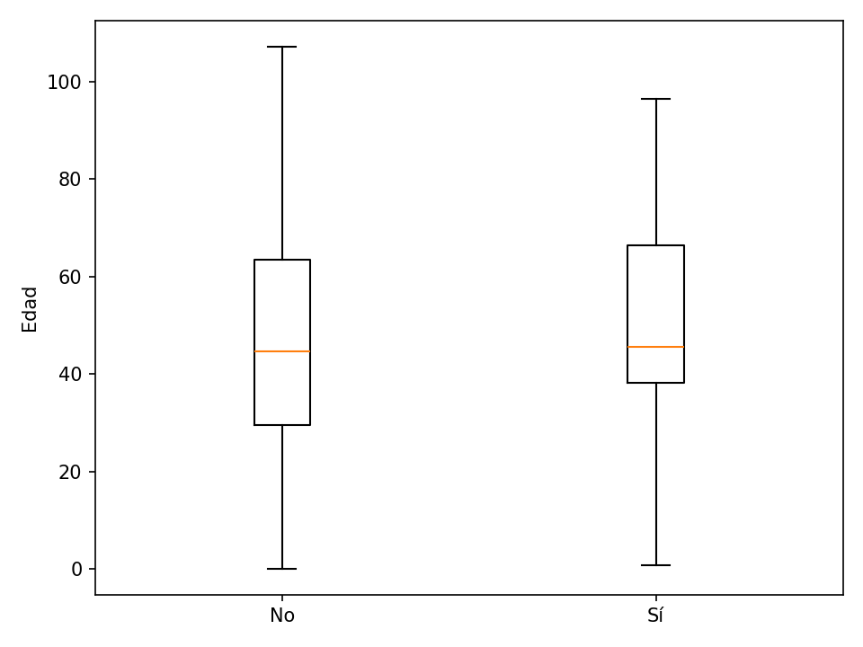

*Figura 5. Distribución de edad según la variable objetivo.*
</div>

El grupo positivo tiene mayor edad promedio, aunque las dos distribuciones se superponen bastante. La edad por sí sola no permite separar las clases y puede estar relacionada con uso de servicios, otras enfermedades y especialidad.

<div style="text-align:center;">
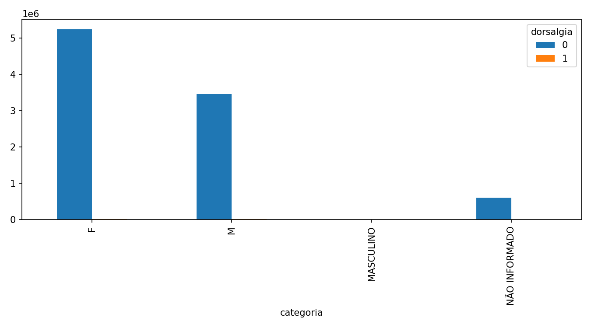

*Figura 6. Distribución de registros por sexo y dorsalgia.*
</div>

Las diferencias por sexo describen cómo está compuesta la base. No deben leerse como riesgo biológico porque existen categorías no informadas, datos contradictorios y distinta frecuencia de contacto con los servicios de salud.

<div style="text-align:center;">
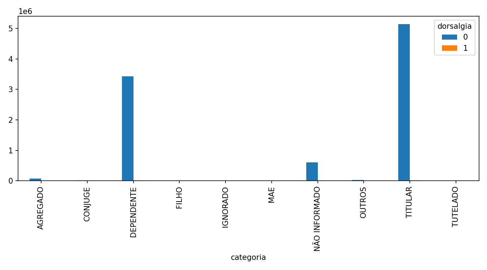

*Figura 7. Tipo de beneficiario según dorsalgia.*
</div>

`TITULAR` fue la categoría más frecuente en la población y también en los cuatro grupos del análisis de errores. Las categorías tienen tamaños muy diferentes, lo que limita comparaciones simples de conteos.

<div style="page-break-before: always;"></div>

<div style="text-align:center;">
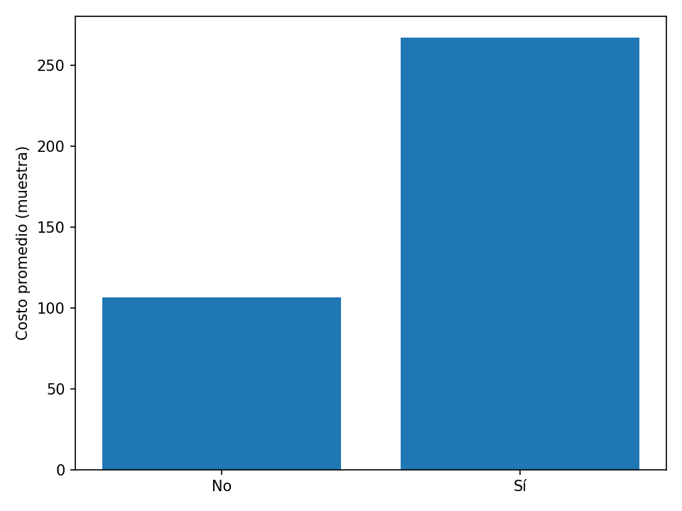

*Figura 8. Costo promedio por registro según dorsalgia.*
</div>

El costo promedio por registro fue 267,35 para el grupo con dorsalgia y 106,60 para el grupo sin ella. Parte de esta diferencia proviene de internaciones y valores extremos.

<div style="text-align:center;">
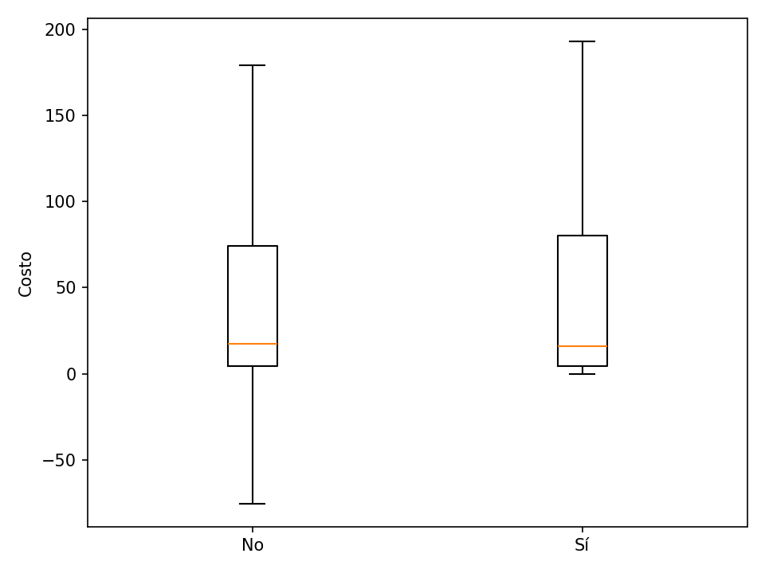

*Figura 9. Distribución central de costos según dorsalgia, sin mostrar atípicos.*
</div>

La comparación muestra que el promedio aislado no describe bien una atención típica. Algunos costos muy altos elevan la media del grupo positivo, mientras la parte central de la distribución es mucho menor.

## 8. Construcción de variables a nivel de beneficiario

La base final contiene **653.631 filas** y 27 columnas antes de excluir identificador y objetivo. Se construyeron edad, sexo, tipo de beneficiario, cantidades de utilizaciones, procedimientos, especialidades, estados y unidades, indicadores de internación y UCI, costos total, promedio, mediano y máximo, conteos CETIPO y categorías más frecuentes.

La edad válida estuvo disponible para 650.155 personas y tuvo promedio de 38,42 años. Se observaron en promedio 3,44 utilizaciones y 7,85 procedimientos diferentes por beneficiario. El 2,46 % presentó internación y el 0,37 % UCI.

<div style="text-align:center;">
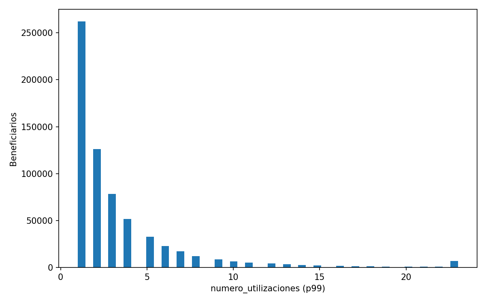

*Figura 10. Distribución del número de utilizaciones por beneficiario.*
</div>

La mayoría de las personas tuvo pocas utilizaciones y un grupo pequeño concentró muchas. Esta variable ayuda a distinguir patrones, pero también mide cuántas oportunidades tuvo cada persona de recibir un diagnóstico.

<div style="text-align:center;">
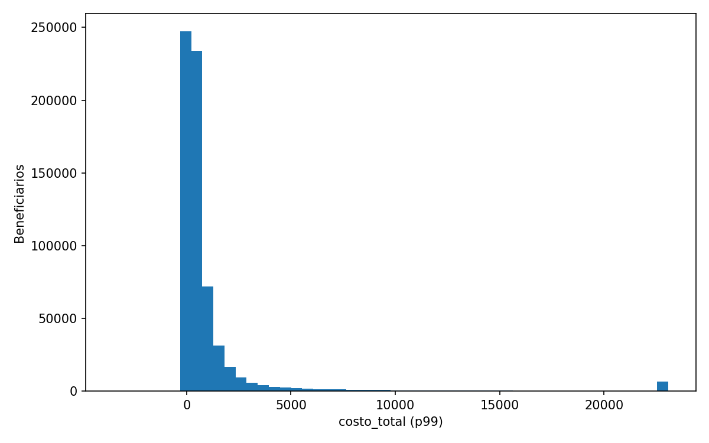

*Figura 11. Distribución del costo total por beneficiario.*
</div>

El costo total promedio fue 1.527,65, con desviación estándar de 9.743,87 y máximo de 1.905.829,57. Un grupo pequeño concentra costos muy altos.

La selección de variables se hizo únicamente con el conjunto de entrenamiento para no usar información de prueba. Se conservaron **22 variables**. `numero_dias_atencion` se excluyó porque era igual a `numero_utilizaciones`; `tuvo_uti`, porque 99,63 % de las personas estaba en una sola categoría; y `porte_anestesico_mas_frecuente`, porque una categoría concentraba 99,45 % de los valores. UCI se mantuvo en los análisis descriptivo, de errores y costos.

## 9. Organización del código reproducible

La estructura cubre explícitamente el contenido mínimo solicitado en el punto 3.1 del taller.

| Archivo | Función dentro del análisis |
|---|---|
| `01_preparacion_datos.py` | Lee por bloques, audita columnas, faltantes, CID, costos e inconsistencias y genera salidas de calidad. |
| `02_variable_objetivo.py` | Construye `dorsalgia` por beneficiario usando el prefijo M54 y guarda su distribución. |
| `03_analisis_descriptivo.py` | Resume registros, beneficiarios, utilizaciones, procedimientos, demografía, servicios y costos. |
| `04_construccion_variables.py` | Agrega las transacciones a una fila por beneficiario y crea la base final de modelamiento. |
| `05_entrenamiento_modelos.py` | Divide de forma estratificada, selecciona variables y entrena los cuatro modelos. |
| `06_evaluacion_comparacion.py` | Calcula métricas, curvas y matrices, y selecciona el mejor modelo. |
| `07_interpretacion_modelo.py` | Extrae importancias, coeficientes y caracteriza errores del conjunto de prueba. |
| `08_estimacion_costos.py` | Agrega costos por utilización M54, compara perfiles y ajusta el modelo exploratorio de costos. |

Además, `common.py` centraliza rutas relativas, limpieza, validación y creación de carpetas. `README.md` contiene el orden de ejecución y `requirements.txt` lista las dependencias.

<div style="page-break-before: always;"></div>

## 10. Modelamiento predictivo

La división estratificada reservó **522.904 beneficiarios** para entrenamiento y **130.727** para prueba, con `random_state=42`. La estratificación mantuvo la proporción de positivos en los dos grupos.

Los faltantes numéricos se completaron con la mediana y los categóricos con la moda. Después se aplicó one-hot encoding, una transformación que crea columnas indicadoras para las categorías. El escalamiento numérico se utilizó únicamente en la regresión logística.

Se entrenaron cuatro modelos:

1. Regresión logística como referencia interpretable, con `class_weight="balanced"` para dar mayor peso a la clase minoritaria.
2. Árbol de decisión con `class_weight="balanced"`, profundidad máxima 8 y mínimo 20 observaciones por hoja.
3. Random Forest con `class_weight="balanced"`, 300 árboles, profundidad máxima 20 y mínimo 5 observaciones por hoja.
4. Gradient Boosting con 150 etapas y pesos muestrales balanceados.

XGBoost era opcional y no estaba instalado. KNN y SVM se omitieron por el tamaño de la base, el desbalance y el costo de trabajar con variables one-hot. Los predictores y la etiqueta corresponden al mismo periodo. Por eso el modelo encuentra relaciones observadas en esos datos, pero no fue diseñado para predecir hacia el futuro antes del diagnóstico.

## 11. Evaluación y comparación de modelos

Accuracy no fue la métrica principal. Con solo 0,0968 % de positivos, un modelo puede acertar casi todos los negativos y obtener una cifra alta sin encontrar casos de dorsalgia.

PR-AUC resume el equilibrio entre precisión y sensibilidad para la clase positiva. La sensibilidad indica qué proporción de positivos reales encuentra el modelo; la especificidad, qué proporción de negativos clasifica correctamente. Gradient Boosting se eligió por tener el mayor PR-AUC y una sensibilidad alta.

**Tabla 1. Métricas de clasificación al umbral predeterminado.**

| Modelo | Accuracy | Precisión | Sensibilidad | Especificidad | F1 |
|---|---:|---:|---:|---:|---:|
| Gradient Boosting | 0,9670 | 0,0271 | **0,9449** | 0,9670 | 0,0527 |
| Random Forest | **0,9844** | **0,0494** | 0,8268 | **0,9845** | **0,0932** |
| Árbol de decisión | 0,9601 | 0,0214 | 0,8976 | 0,9601 | 0,0419 |
| Regresión logística | 0,9539 | 0,0189 | 0,9134 | 0,9540 | 0,0371 |

**Tabla 2. Métricas independientes del umbral.**

| Modelo | ROC-AUC | PR-AUC |
|---|---:|---:|
| Gradient Boosting | 0,9859 | **0,1904** |
| Random Forest | **0,9898** | 0,1838 |
| Árbol de decisión | 0,9486 | 0,1017 |
| Regresión logística | 0,9757 | 0,0604 |

<div style="text-align:center;">
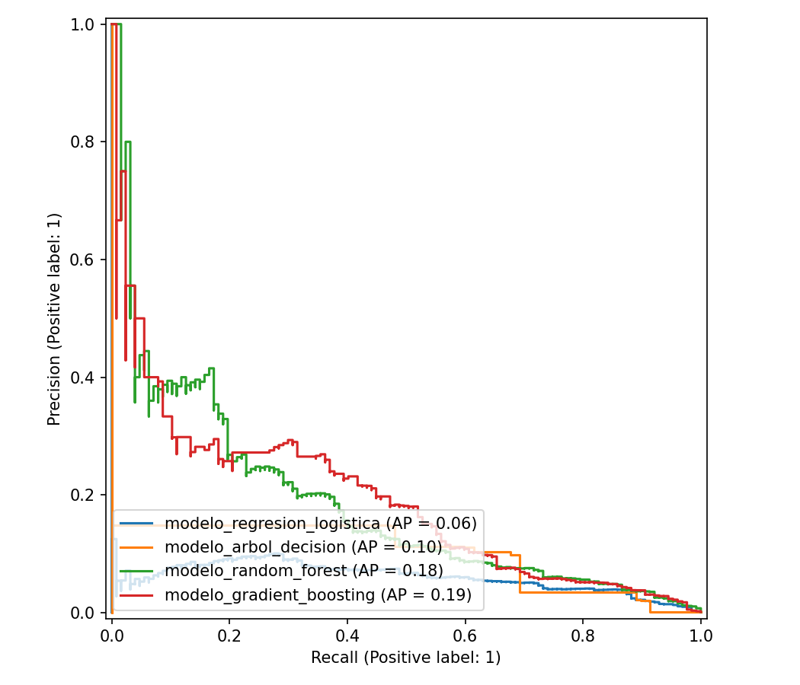

*Figura 12. Curvas Precision-Recall de los modelos evaluados.*
</div>

Gradient Boosting alcanzó PR-AUC de 0,1904. Random Forest quedó cerca, con 0,1838, y obtuvo mejor precisión y F1. Frente a una referencia aleatoria cercana a 0,001, ambos modelos aprendieron patrones útiles. Aun así, la precisión es baja y muchas alertas no corresponden a personas con M54 registrado.

<div style="text-align:center;">
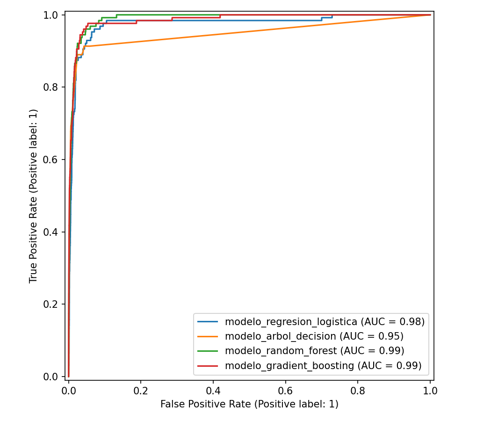

*Figura 13. Curvas ROC de los modelos evaluados.*
</div>

Las ROC-AUC son altas, pero este resultado hay que leerlo con cuidado porque hay muchísimos negativos. Random Forest tiene la mayor ROC-AUC. Sin embargo, Gradient Boosting responde mejor al criterio definido para la clase minoritaria.

<div style="text-align:center;">
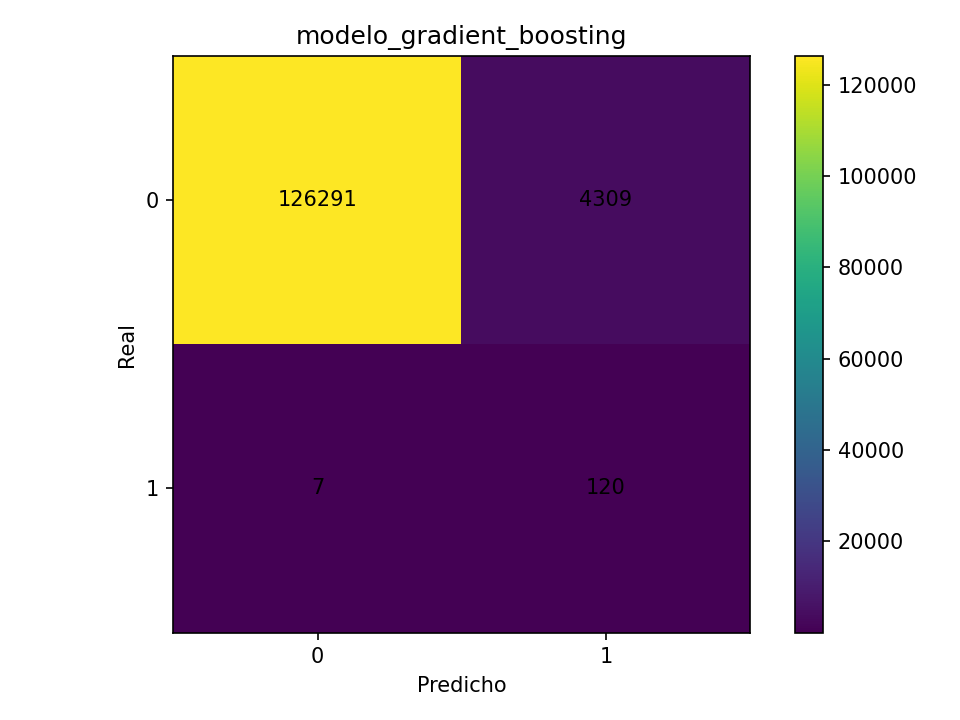

*Figura 14. Matriz de confusión de Gradient Boosting.*
</div>

La matriz de confusión resume los aciertos y errores de cada clase. Gradient Boosting detectó **120 de 127 positivos**, dejó **7 falsos negativos**, produjo **4.309 falsos positivos** y clasificó correctamente **126.291 negativos**.

El modelo encuentra muchos positivos, pero también genera muchas alertas falsas. Random Forest sería una alternativa útil si se quisiera reducir esas alertas: produjo 2.021 falsos positivos y obtuvo mejor precisión y F1, aunque dejó sin detectar 22 positivos.

<div style="page-break-before: always;"></div>

## 12. Interpretación de resultados

<div style="text-align:center;">
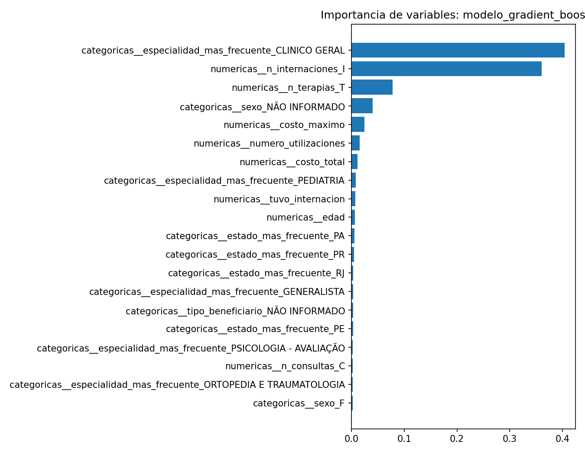

*Figura 15. Principales importancias del mejor modelo de árboles.*
</div>

En Gradient Boosting, las variables con mayor peso fueron `especialidad_mas_frecuente_CLINICO GERAL` (0,404), `n_internaciones_I` (0,361), `n_terapias_T` (0,078), sexo no informado (0,041) y costo máximo (0,024). En Random Forest el peso se repartió entre especialidad, costos, internación, utilización y procedimientos.

Esto muestra que los modelos se apoyan principalmente en la forma en que las personas usan los servicios. Las importancias ordenan variables según su aporte a la predicción, pero no indican cuánto cambiaría el riesgo si una de ellas cambiara.

<div style="text-align:center;">
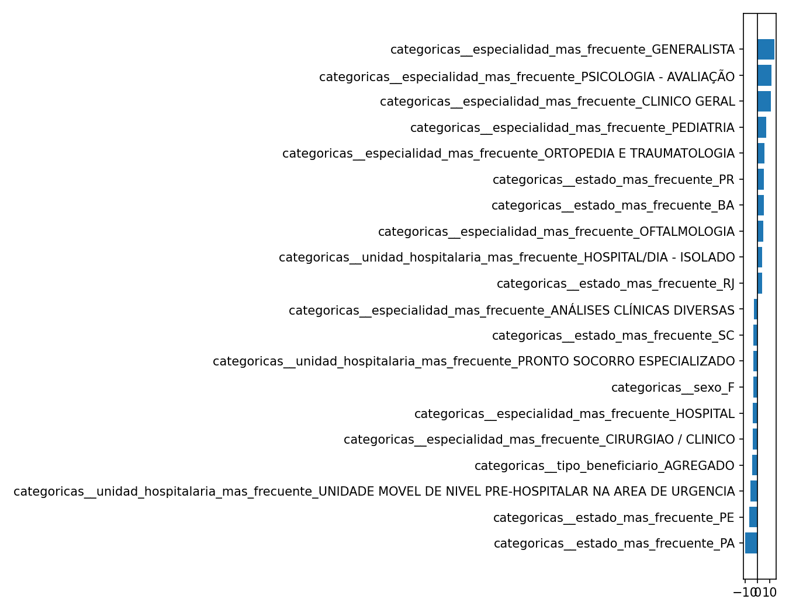

*Figura 16. Coeficientes positivos y negativos más extremos de la regresión logística.*
</div>

Los coeficientes positivos incluyeron `GENERALISTA`, `CLINICO GERAL` y `ORTOPEDIA E TRAUMATOLOGIA`. Algunas categorías territoriales, de unidad y especialidad tuvieron coeficientes negativos.

Los coeficientes más extremos pueden aparecer cuando una categoría tiene pocos casos o separa casi por completo las clases. Por eso se interpretó su dirección, no el odds ratio como si fuera un efecto clínico estable.

Las variables importantes describen intensidad y contexto de atención. Una persona con más consultas e internaciones tiene más oportunidades de recibir un CID. Esto no significa que esas variables causen dorsalgia; no se puede afirmar causalidad con estos datos.

## 13. Análisis de errores

Los **7 falsos negativos** tuvieron edad promedio de 48,67 años, 5,43 utilizaciones y costo total promedio de 2.954,06. Ninguno presentó internación o UCI. Son pocos para generalizar, pero importan porque corresponden a casos M54 que el modelo no encontró.

Los **4.309 falsos positivos** tuvieron 9,46 utilizaciones en promedio y costo total de 15.762,83; 56,1 % presentó internación y 9,1 % UCI. Los verdaderos positivos promediaron 8,42 utilizaciones y costo de 13.573,30. Los verdaderos negativos tuvieron 3,22 utilizaciones y costo de 1.031,23.

El modelo tiende a asignar mayor riesgo a personas con atención intensa y costosa, incluso cuando no tienen M54 registrado. Algunos falsos positivos podrían corresponder a casos cuyo diagnóstico no quedó consignado, pero la base no permite comprobarlo.

<div style="page-break-before: always;"></div>

## 14. Estimación del costo esperado asociado a dorsalgia

El costo se calculó por utilización beneficiario-fecha. Los procedimientos realizados a la misma persona en la misma fecha se sumaron para no fragmentar una atención. Se identificaron **1.262 utilizaciones M54** y **2.249.045 no M54** con costo válido.

<div style="text-align:center;">
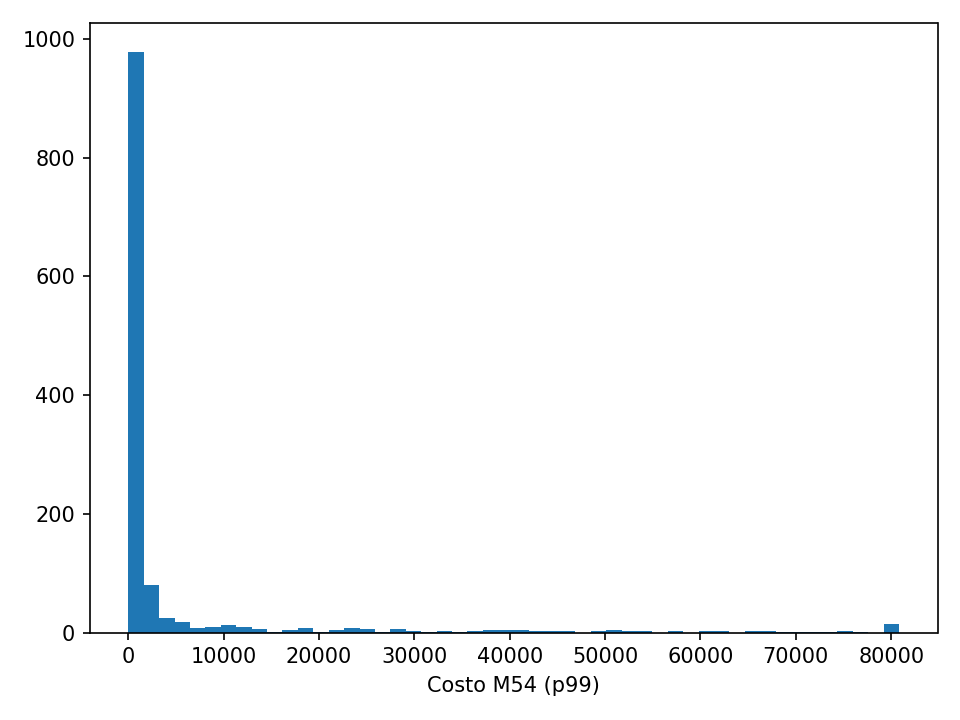

*Figura 17. Distribución de costos de utilizaciones M54.*
</div>

El promedio M54 fue **5.627,86**, mientras la mediana fue **200,02**. El percentil 90 llegó a 12.215,89, el 95 a 38.089,75, el 99 a 80.813,43 y el máximo a 320.827,54.

El promedio sube por algunas atenciones muy costosas y no describe bien el caso habitual. La mediana ayuda a representar mejor una utilización típica, mientras los percentiles muestran el tamaño de la cola de costos altos.

<div style="text-align:center;">
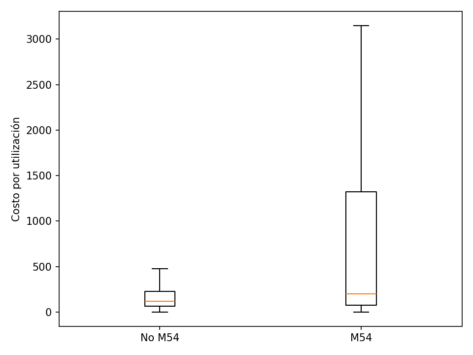

*Figura 18. Comparación de costos entre utilizaciones M54 y no M54.*
</div>

Las utilizaciones no M54 tuvieron promedio de 440,82 y mediana de 120,00. Las atenciones M54 muestran mayor costo y dispersión. Este resultado hay que leerlo con cuidado porque la composición de internaciones, UCI y servicios es diferente. La comparación no prueba que el diagnóstico cause el aumento.

<div style="text-align:center;">
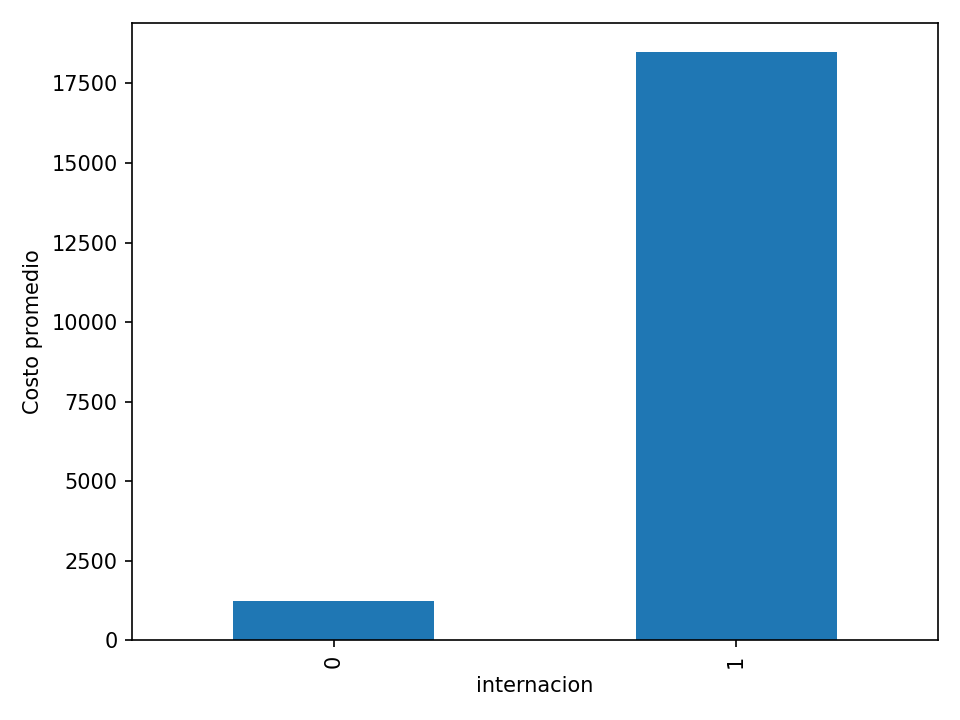

*Figura 19. Costo promedio M54 según internación.*
</div>

Con internación, el promedio fue 18.491,18 y la mediana 3.972,11. Sin internación fueron 1.221,48 y 167,00. La diferencia muestra que las hospitalizaciones elevan mucho el costo observado.

<div style="text-align:center;">
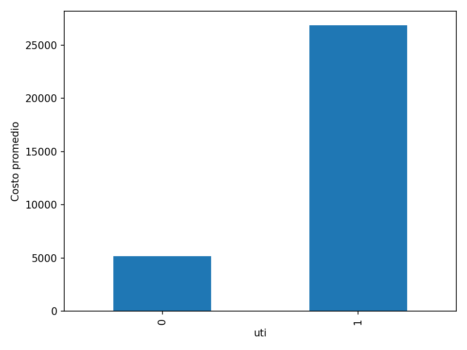

*Figura 20. Costo promedio M54 según UCI.*
</div>

Las 26 utilizaciones con UCI tuvieron promedio de 26.878,49 y mediana de 8.490,28, frente a un promedio de 5.180,84 sin UCI. UCI también se relaciona con costos mucho mayores. Sin embargo, el grupo es pequeño y la cifra puede cambiar por unos pocos casos.

El Random Forest de costos, entrenado sobre `log1p(costo)`, usó 1.009 observaciones para entrenamiento y 253 para prueba. Obtuvo MAE de 4.721,83, RMSE de 17.109,25 y **R² de 0,098**.

<div style="text-align:center;">
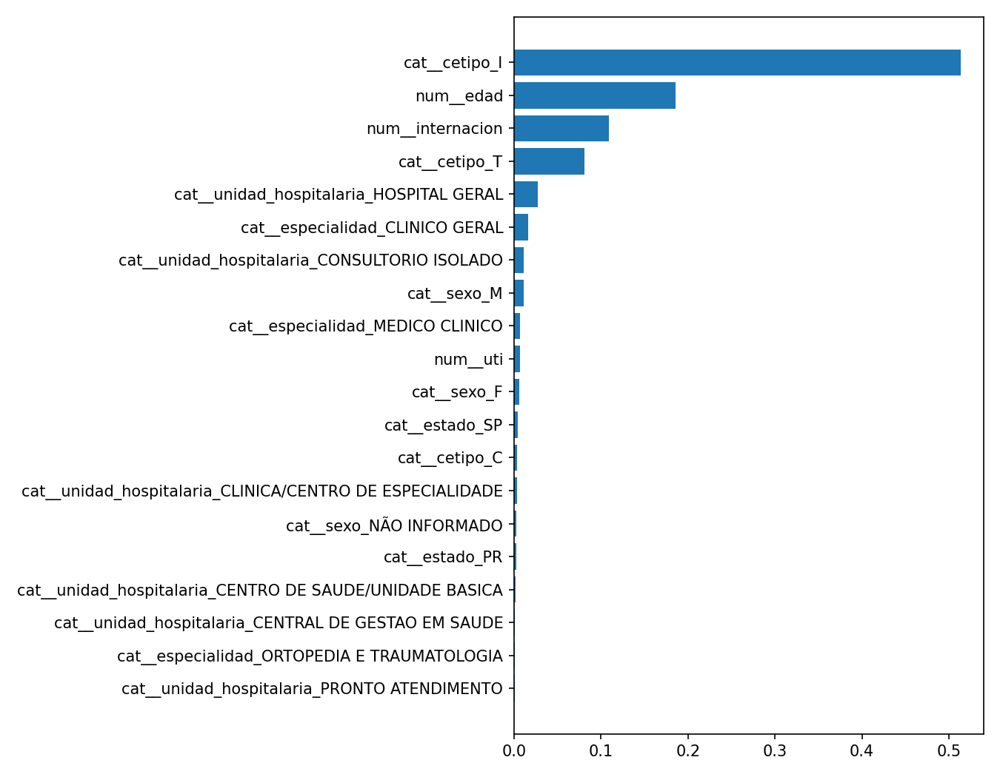

*Figura 21. Variables importantes en el modelo exploratorio de costos.*
</div>

CETIPO internación (0,514), edad (0,186), indicador de internación (0,109), CETIPO terapia (0,081) y hospital general (0,027) fueron las variables principales.

El R² de 0,098 es bajo: el modelo solo explica una parte pequeña de las diferencias de costo. Por eso se trató como un ejercicio exploratorio. No es suficientemente preciso para presupuestar una atención individual.

## 15. Limitaciones

- Cerca de 83,7 % de los registros no tenía CID utilizable. Algunas personas etiquetadas como negativas podrían tener dorsalgia sin registrar.
- Solo 633 beneficiarios fueron positivos; las métricas pueden cambiar con pocos casos adicionales.
- Los datos son transaccionales y reflejan uso de servicios, no historia clínica completa.
- Pueden existir diagnósticos no registrados, es decir, casos de M54 que no quedaron consignados en la base.
- Hay contradicciones demográficas, costos negativos, ceros y valores extremos.
- Los modelos encuentran relaciones entre variables, pero no prueban causalidad.
- Utilización, internación y costos pueden reflejar mayor contacto con el sistema, no necesariamente mayor riesgo clínico.
- No hay una separación temporal clara entre predictores y diagnóstico, así que el modelo no fue construido para predecir hacia el futuro.
- Los coeficientes de categorías raras pueden ser inestables.
- El modelo de costos se entrenó con pocas utilizaciones M54 y obtuvo un R² bajo.

## 16. Trabajos futuros

Un análisis posterior debería definir una fecha de referencia y utilizar solo información anterior para predecir un M54 futuro. También convendría validar el modelo en otra población o periodo, revisar una muestra de falsos positivos, estudiar diagnósticos ausentes y agrupar categorías raras.

Para costos sería útil separar atenciones ambulatorias e internaciones, depurar ajustes contables y estimar intervalos de predicción. Otros caminos son modelos longitudinales, mejores variables clínicas y herramientas de interpretación como SHAP o dependencia parcial.

## 17. Conclusiones

El análisis resumió más de nueve millones de registros en una base reproducible de 653.631 beneficiarios. Solo 633 personas tuvieron un M54 registrado, equivalentes a 0,0968 %. Esta proporción tan baja hizo necesario evaluar los modelos con medidas enfocadas en la clase positiva.

Gradient Boosting fue seleccionado por su PR-AUC de 0,1904 y sensibilidad de 0,9449. Encontró casi todos los positivos, pero produjo muchas alertas falsas. Random Forest tuvo mejor precisión y F1, aunque su sensibilidad fue menor. La elección entre ambos depende de si se quiere encontrar más casos o reducir revisiones innecesarias.

Las variables con mayor peso describen especialidad, internaciones, terapias, uso de servicios y costos. Ayudan a reconocer patrones de atención, pero no permiten afirmar que esos factores causen dorsalgia. El alto porcentaje de CID faltante y la falta de una secuencia temporal clara limitan la interpretación clínica.

El costo M54 fue mayor y más variable que el no M54. Internación y UCI marcaron las diferencias más grandes. El R² de 0,098 confirma que el modelo de costos tiene un alcance limitado. En este caso, la mediana, los percentiles y los resúmenes por perfil son más útiles que una predicción puntual.

El trabajo cumple el objetivo de integrar preparación, modelamiento, evaluación, interpretación y costos. El resultado es útil para el ejercicio académico, pero su uso en otro contexto requeriría validación externa, un diseño temporal y mejor información clínica.

<div style="page-break-before: always;"></div>

## 18. Instrucciones de reproducibilidad

La base debe ubicarse en `data/db_2026.csv`; no se incluye en el repositorio por tamaño y privacidad. Desde la raíz del proyecto se ejecuta un único bloque de comandos:

```bash
python -m pip install -r requirements.txt
python 01_preparacion_datos.py
python 02_variable_objetivo.py
python 03_analisis_descriptivo.py
python 04_construccion_variables.py
python 05_entrenamiento_modelos.py
python 06_evaluacion_comparacion.py
python 07_interpretacion_modelo.py
python 08_estimacion_costos.py
```

Las tablas se guardan en `outputs/tablas`, las figuras en `outputs/figuras` y los modelos en `outputs/modelos`. Los scripts usan rutas relativas y semilla 42. La base y los modelos serializados se excluyen de Git mediante `.gitignore`.

## 19. Referencias consultadas

- Organización Mundial de la Salud. [ICD-10 Browser, versión 2019](https://icd.who.int/browse10/2019/en).
- Organización Mundial de la Salud. [International Classification of Diseases](https://www.who.int/standards/classifications/classification-of-diseases).
- Agência Nacional de Saúde Suplementar. [Padrão TISS: tabelas relacionadas](https://www.gov.br/ans/pt-br/assuntos/prestadores/padrao-para-troca-de-informacao-de-saude-suplementar-2013-tiss/padrao-tiss-tabelas-relacionadas).
