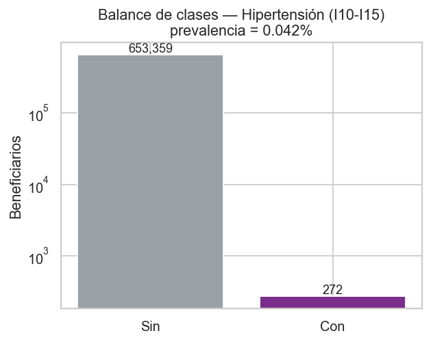
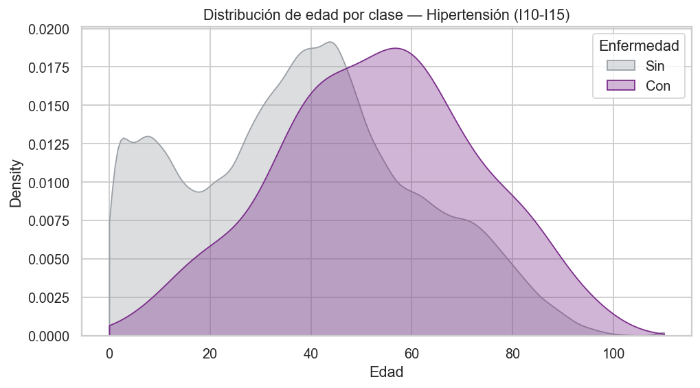
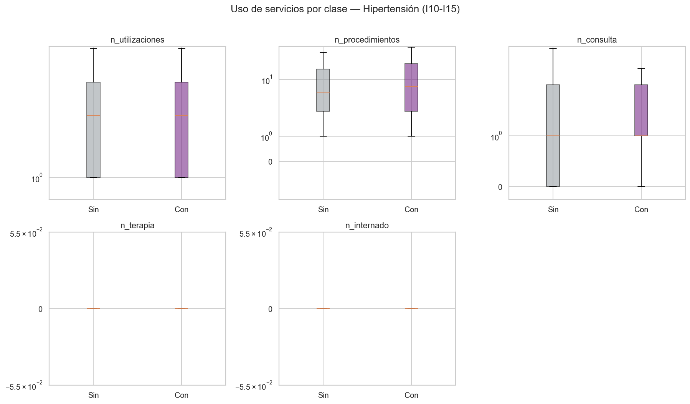
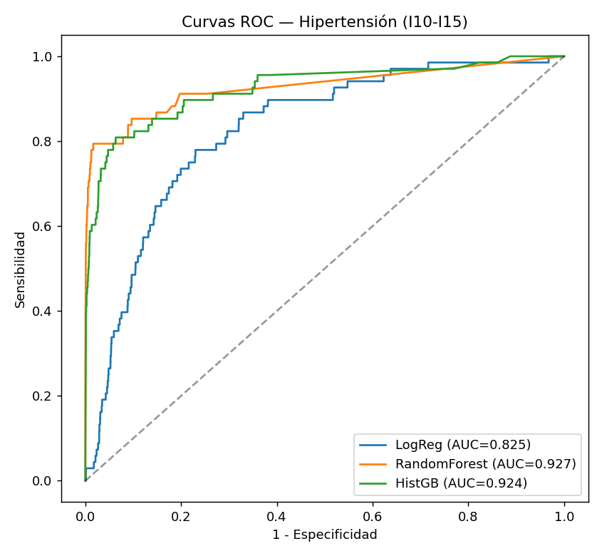
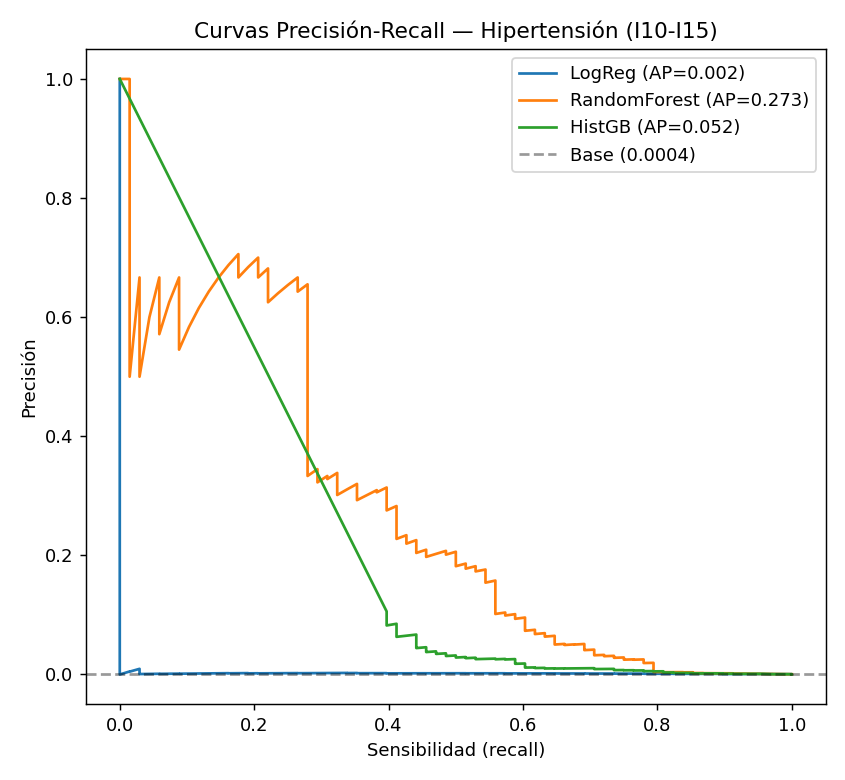
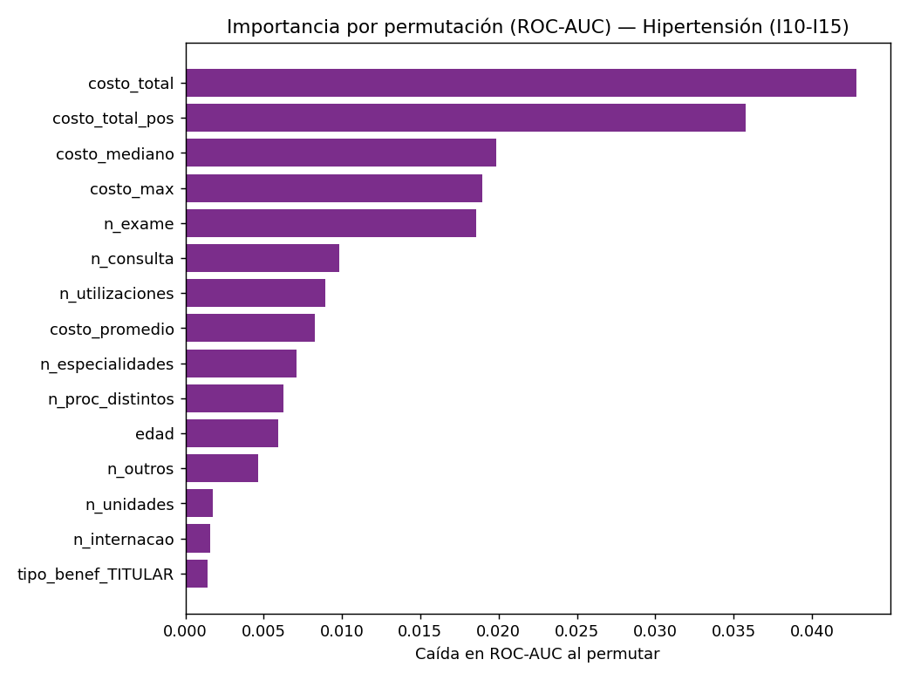
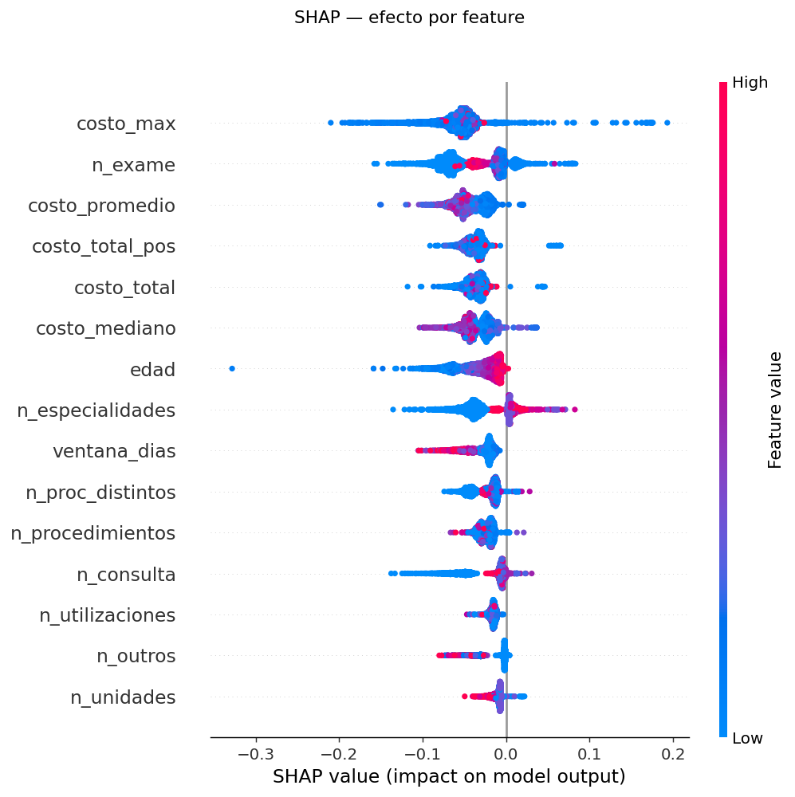
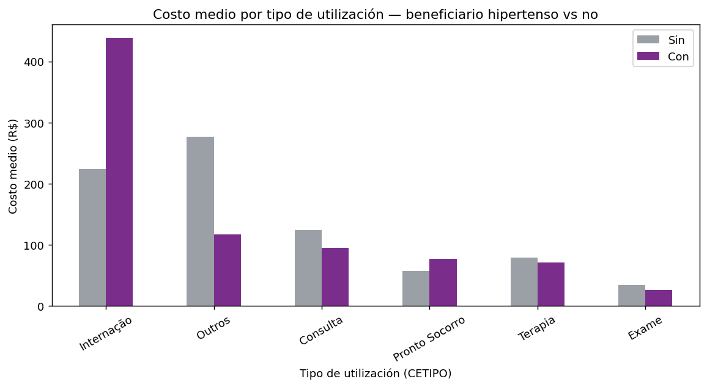

# Minería de datos sobre utilización en salud: identificación de beneficiarios con enfermedad hipertensiva (CID I10–I15)

**Taller 3 — Minería de Datos (2016325)**
    Tomás Nicolás Jerez Garcia · Universidad Nacional de Colombia

---

## Resumen ejecutivo

Se analizó una base de **9.345.278 utilizaciones** en salud correspondientes a **653.631 beneficiarios** para construir un clasificador binario que identifique a los beneficiarios con **enfermedad hipertensiva (CID I10–I15)** a partir de sus patrones de uso. El reto central resultó ser la **subcodificación del diagnóstico**: el 90 % de los beneficiarios tiene el CID como el literal `"N/A"`, de modo que solo **272 beneficiarios (0.042 %)** quedan etiquetados como positivos. Es, por lo tanto, un problema de **clasificación de evento raro extremo** (desbalance ≈ 1:2400).

Pese a ello, un modelo **Random Forest** alcanzó **ROC-AUC = 0.93** y **PR-AUC = 0.36** frente a una línea base de 0.0004 (un *lift* de ~600×). Un **test de permutación de etiquetas** (AUC con el target barajado → 0.51) descarta fuga de información. La interpretación muestra que la señal proviene mayoritariamente de la **intensidad de uso y el costo** —el *footprint* del manejo ambulatorio crónico— más que de marcadores fisiológicos de la enfermedad, lo que introduce un sesgo de selección que se discute en detalle. Finalmente, el costo de una utilización codificada como hipertensión es bajo en la mediana (R$ 18), pero los beneficiarios hipertensos cuestan en promedio **3.7× más al año** por una cola de casos complejos.

---

## 1. Comprensión del problema

El objetivo es predecir, a nivel de **beneficiario**, si presenta enfermedad hipertensiva, definida como la presencia de al menos una utilización con un código CID en el rango **I10–I15** (hipertensión esencial y enfermedades hipertensivas asociadas). Se eligió el bloque completo I10–I15 en lugar de solo I10 para maximizar el número de positivos, de forma análoga al ejemplo de diabetes (E10–E14) del enunciado.

La variable objetivo se construye por agregación:

$$\text{target}_i = \mathbb{1}\left[\exists\; t \in T_i : \text{CID}_t \in \{I10, \dots, I15\}\right]$$

donde $T_i$ son las transacciones del beneficiario $i$.

**Hallazgo que condiciona todo el trabajo.** Un escaneo inicial de prevalencia reveló que ninguna enfermedad identificable por CID supera el 0.2 % de prevalencia a nivel de beneficiario. La causa es que el CID está ausente (como `"N/A"` o vacío) en la gran mayoría de las utilizaciones: solo una minoría de beneficiarios tiene algún diagnóstico registrado. En consecuencia, el problema no es de clasificación balanceada sino de **detección de evento raro**, y esta característica —más que la elección de la enfermedad— define la metodología de todo el taller.

---

## 2. Datos y preparación

### 2.1 Fuente y volumen

| Concepto | Valor |
|---|---|
| Transacciones (procedimientos) | 9.345.278 |
| Beneficiarios únicos | 653.631 |
| Utilizaciones (visita-día distinta) | 2.250.307 |
| Procedimientos distintos | 3.252 |
| Rango de fechas | 2026-01-01 a 2026-12-08 |

Cada fila representa un procedimiento; un beneficiario puede tener múltiples procedimientos por visita-día. Se distinguió explícitamente `n_procedimientos` (filas) de `n_utilizaciones` (pares `CHAVE_FUNCIONAL`+fecha) para no inflar los conteos de uso.

### 2.2 Calidad de datos

Los principales problemas detectados fueron:

- **CID ausente en ~90 %.** El código diagnóstico viene como el literal `"N/A"` para **588.573 de 653.631 beneficiarios (90.0 %)**, además de valores nulos/vacíos (6.6 % de las filas). Solo una minoría de beneficiarios tiene un diagnóstico real registrado. Este es el problema de calidad dominante y la razón de la baja prevalencia.
- **Valores faltantes codificados de forma heterogénea.** Se encontraron al menos cuatro representaciones distintas de "faltante": `NaN`, cadena vacía `''`, el guion `'-'` (en especialidad, UF y tipo de unidad) y las etiquetas `'Não Informado'`/`'IGNORADO'`. Tasas de faltante: especialidad **73.2 %**, UF **28.8 %**, tipo de unidad **28.8 %**, sexo **6.5 %**, valor **0 %**.
- **Inconsistencias por beneficiario.** 525 beneficiarios tienen más de un sexo registrado entre sus transacciones; 0 tienen más de una fecha de nacimiento distinta. 3.165 beneficiarios presentan edades imposibles (< 0 o > 110) por fechas de nacimiento erróneas.
- **Costo (`VALOR_UTILIZACAO`) con cola pesada, negativos y ceros.** Rango [−27.537 ; 628.389], media 106.85 pero mediana 17.39 (fuerte asimetría a la derecha). 3.001 valores negativos (reversas/estornos) y 70.394 ceros.

### 2.3 Tratamiento aplicado

- **Unificación de faltantes:** todo valor en `{'', '-', 'N/A', 'NA', 'NULL', 'Não Informado', 'IGNORADO'}` se mapeó a `NULL`; el sexo se consideró válido solo si es `F`/`M`.
- **Resolución de inconsistencias:** el sexo y la fecha de nacimiento se colapsaron al valor **más frecuente (moda)** por beneficiario, conservando indicadores del número de valores distintos para reportar el problema.
- **Edad:** calculada como (última utilización − fecha de nacimiento resuelta); las edades imposibles se acotaron a [0, 110] y se marcaron con una bandera.
- **Costo:** se conservó el valor tal cual para las features (sumas netas y positivas por separado), reportando negativos y outliers; para el modelo de costo (§8) se usaron solo valores positivos.

Todo el procesamiento de los 1.6 GB se hizo con **DuckDB** (SQL *out-of-core*), evitando cargar la base completa en memoria; la agregación produce una tabla compacta a nivel de beneficiario.

---

## 3. Análisis descriptivo

**Distribución del target.** 272 beneficiarios positivos frente a 653.359 negativos (prevalencia **0.042 %**). El desbalance extremo se observa en la Figura 1.

*Figura 1. Balance de clases (escala logarítmica).*

**Perfil de los positivos.** Comparando medianas por clase, los beneficiarios hipertensos son **mayores** (mediana de edad 53 vs 39 años) y con algo más de actividad (`n_procedimientos` 7 vs 5; `n_proc_distintos` 4 vs 3; `n_especialidades` 1 vs 0). El costo total mediano es similar o levemente menor (R$ 292 vs 330), con un costo por transacción también menor (`costo_promedio` R$ 48 vs 74): **más utilizaciones, pero más baratas**, consistente con el manejo ambulatorio de una condición crónica.

*Figura 2. Distribución de edad por clase — la edad es el separador demográfico más claro.*

*Figura 3. Uso de servicios por clase (escala symlog).*

Las figuras de distribución por sexo/tipo, del costo (cola pesada) y de correlación entre features complementan el análisis (`03_*`, `05_*`, `06_*` en `outputs/figures/`).

---

## 4. Construcción de variables (features)

Se agregaron features a nivel de beneficiario en tres grupos, **excluyendo por completo el CID** de los predictores para evitar fuga de información (el CID define el target):

- **Demografía:** edad, sexo (moda), tipo de beneficiario (moda).
- **Intensidad y tipo de uso:** número de utilizaciones, procedimientos, procedimientos distintos, especialidades distintas, estados y unidades distintas; conteos por tipo de utilización (`Exame`, `Consulta`, `Internação`, `Terapia`, `Pronto Socorro`, `Outros`); número de internaciones y de usos de UCI; ventana temporal de actividad.
- **Costo:** costo total (neto y positivo), promedio, mediano, máximo y número de transacciones negativas.

**Decisión metodológica clave — naturaleza del modelo.** Dado que la etiqueta se deriva de las mismas transacciones de las que se extraen las features, este es un modelo de **identificación/perfilamiento concurrente** del *footprint* de la enfermedad, no un modelo de riesgo prospectivo. Features como el número de consultas o el contacto con cardiología son *consecuencia* de tener la enfermedad, no causas anteriores; se mantienen por ser señales de uso legítimas, pero su carácter asociativo se hace explícito en la interpretación.

---

## 5. Modelado

Se entrenaron y compararon **tres modelos** con manejo del desbalance:

1. **Regresión Logística** (`class_weight='balanced'`) — línea base interpretable.
2. **Random Forest** (`class_weight='balanced_subsample'`, submuestreo por árbol).
3. **HistGradientBoosting** (`class_weight='balanced'`).

**Manejo del desbalance:** ponderación de clases (no se usó SMOTE, poco fiable con 272 positivos en un espacio de alta dimensión). **Estimación estable:** validación cruzada estratificada **repetida** (5 folds × 2 repeticiones) para ROC-AUC y PR-AUC. **Umbral:** ajustado sobre predicciones *out-of-fold* mediante el índice de **Youden** (no en el conjunto de test). El *split* se hizo a **nivel de beneficiario** (una fila por persona), de modo que ningún beneficiario aparece simultáneamente en entrenamiento y test. El preprocesamiento (imputación, estandarización, one-hot) se ajusta **dentro de cada fold** vía `Pipeline`.

---

## 6. Evaluación

### 6.1 Comparación de modelos

| Modelo | CV ROC-AUC | CV PR-AUC | Test ROC-AUC | Test PR-AUC |
|---|---|---|---|---|
| Regresión Logística | 0.794 ± 0.033 | 0.003 | 0.825 | 0.002 |
| **Random Forest** | **0.909 ± 0.029** | **0.357** | **0.927** | **0.273** |
| HistGradientBoosting | 0.920 ± 0.024 | 0.086 | 0.924 | 0.052 |

*Línea base de PR-AUC = prevalencia = 0.0004.*

Los tres modelos superan ampliamente el objetivo de 0.85 en ROC-AUC. Aunque HistGB tiene un ROC-AUC marginalmente superior, se elige **Random Forest como modelo campeón** porque en un problema de evento raro la **PR-AUC** es la métrica relevante, y ahí RF domina claramente (0.357 vs 0.086 en CV): un *lift* de ~600× sobre la línea base. El modelo lineal (logística) se queda muy atrás en PR-AUC, confirmando que el patrón no es lineal.

*Figuras 4–5. Curvas ROC y Precisión-Recall en el conjunto de test.*

En el punto de operación de Youden, el modelo mantiene **especificidad muy alta** con una sensibilidad ajustable según el uso; dada la prevalencia de 0.04 %, cualquier umbral con sensibilidad razonable produce muchos falsos positivos (baja precisión), lo cual es intrínseco a detectar una condición tan rara y se visualiza en la curva PR.

### 6.2 Validación de fuga de información y ablación

Ante la alta AUC, se realizó un **test de permutación de etiquetas**: se reentrenó el modelo con el target barajado al azar.

| Configuración | ROC-AUC |
|---|---|
| Etiquetas **reales** | **0.941 ± 0.014** |
| Etiquetas barajadas (promedio de 3) | **0.506** |

Con etiquetas aleatorias el modelo cae a ≈ 0.50 (azar), lo que **descarta fuga de información**: la señal proviene de features legítimas, no de una filtración del target. (Un pipeline con *leakage* daría > 0.5 incluso con etiquetas barajadas.)

Una **ablación por grupos de features** revela de dónde viene la señal:

| Subconjunto | ROC-AUC |
|---|---|
| Solo demografía (edad, sexo, tipo) | 0.661 |
| Solo costo | 0.919 |
| Sin costo (uso + demografía) | 0.917 |
| Todas las features | 0.941 |

Los grupos de costo y de uso son **cada uno** casi tan predictivos como el modelo completo (~0.92) y **redundantes** entre sí (juntos solo llegan a 0.94). La demografía sola alcanza 0.66. Esto indica que la señal dominante es la **intensidad de uso del sistema de salud**, capturada de forma equivalente por el costo o por los conteos de utilización.

---

## 7. Interpretación

La importancia por permutación (caída en ROC-AUC al permutar cada feature sobre un *holdout*) ordena:

1. `costo_total`, `costo_total_pos`, `costo_mediano`, `costo_max`
2. `n_exame`, `n_consulta`, `n_utilizaciones`
3. `n_especialidades`, `n_proc_distintos`
4. `edad` (posición 11)

*Figuras 6–7. Importancia por permutación y valores SHAP.*

**Lectura crítica.** Que la edad quede en la posición 11 —pese a ser el separador univariado más claro— se explica porque la **importancia por permutación subestima features correlacionadas**: la edad está correlacionada con el volumen de uso y el costo, así que permutarla sola casi no afecta el desempeño porque otras features la reemplazan. Su baja posición no implica irrelevancia sino **redundancia**; el análisis SHAP, que reparte la contribución de forma distinta, tiende a elevarla.

**Interpretación de fondo (y sesgo central).** El modelo detecta principalmente el **perfil de uso de un paciente crónico documentado** —consultas y exámenes repetidos y baratos, costo total moderado— más que marcadores fisiológicos específicos de la hipertensión. Esto es coherente con la ablación (costo y uso dominan; edad aporta poco de forma independiente) y con la naturaleza de la etiqueta: como el 90 % de los diagnósticos no se codifican, los 272 positivos son "hipertensos **documentados**", y quien recibe un diagnóstico documentado tiende a usar más el sistema. El modelo está, por tanto, parcialmente **confundido con el *engagement*** y con el mecanismo de selección de quién termina con un CID registrado. La predicción del *label* es válida y robusta, pero no debe interpretarse como detección causal de la enfermedad.

---

## 8. Estimación de costo

**Costo de la utilización codificada como I10–I15** (n = 2.587 líneas con costo > 0): media **R$ 391.81**, mediana **R$ 18.00**, IQR [3.48 ; 87.50]. La utilización hipertensiva típica es barata (consultas, controles, labs de rutina), pero la media se dispara por una cola de eventos costosos.

**Costo por beneficiario en la ventana observada:**

| | n | Media | Mediana |
|---|---|---|---|
| No hipertenso (por transacción) | 9.265.178 | R$ 107.61 | R$ 17.87 |
| Hipertenso (por transacción) | 6.705 | R$ 229.91 | R$ 16.85 |
| **No hipertenso (total anual)** | — | **R$ 1.527.66** | R$ 330.00 |
| **Hipertenso (total anual)** | — | **R$ 5.667.56** | R$ 292.14 |

El beneficiario hipertenso cuesta en promedio **3.7× más al año** (R$ 5.668 vs 1.528), pero su costo **mediano** es incluso algo menor (R$ 292 vs 330): la diferencia la produce una **cola de casos complejos** (complicaciones, hospitalizaciones), no un mayor costo del beneficiario típico.

**Modelo Gamma GLM (link log)** sobre 300.000 transacciones con costo positivo, `valor ~ tipo de utilización + línea/beneficiario hipertenso + UTI + internación`. Factores multiplicativos sobre el costo esperado (exp del coeficiente):

| Efecto | Factor | p-valor |
|---|---|---|
| Intercepto (consulta de referencia) | R$ 124.4 | < 0.001 |
| UTI | ×5.57 | < 0.001 |
| `Outros` | ×2.15 | < 0.001 |
| Internación | ×1.54 | < 0.001 |
| `Internação` (CETIPO) | ×1.50 | < 0.001 |
| `Terapia` | ×0.61 | < 0.001 |
| `Pronto Socorro` | ×0.45 | < 0.001 |
| `Exame` | ×0.27 | < 0.001 |
| Línea codificada como hipertensión | ×2.39 | 0.19 (n.s.) |
| Beneficiario hipertenso | ×0.52 | 0.10 |

*Figura 8. Costo medio por tipo de utilización, hipertensos vs no.*

**Conclusión del costo.** El costo esperado lo determina sobre todo el **tipo de utilización** (UCI ×5.6, internación ×1.5; exámenes y urgencias mucho más baratos). Los indicadores de hipertensión no son *drivers* significativos del costo por transacción una vez se controla el tipo (línea hipertensiva n.s.; beneficiario hipertenso incluso con factor < 1). Es decir, el sobrecosto de la hipertensión es **indirecto**: proviene del mayor **volumen** de utilizaciones y de una cola de eventos graves, no de que cada transacción sea intrínsecamente más cara.

---

## 9. Limitaciones y sesgos

1. **Subcodificación del diagnóstico (limitación principal).** Con el CID ausente en ~90 % de las transacciones, la etiqueta captura solo hipertensión **documentada**. Muchos hipertensos reales están en la clase negativa (falsos negativos de etiqueta), lo que introduce ruido y sesgo.
2. **Sesgo de selección / confounding de *engagement*.** Los positivos son pacientes con más contacto con el sistema; el modelo detecta parcialmente ese *engagement*, no la fisiología de la enfermedad (evidenciado por la ablación).
3. **Baja precisión intrínseca.** Con prevalencia 0.04 %, aun un modelo con alta ROC-AUC produce baja precisión operativa; la PR-AUC (0.36) es alta en términos de *lift* pero baja en valor absoluto.
4. **Pocos positivos (272).** Las estimaciones tienen varianza; se mitigó con CV repetida, pero los intervalos son amplios.
5. **Importancia por permutación con features correlacionadas.** Subestima variables redundantes (p. ej. edad); se contrastó con SHAP.
6. **Supuesto del GLM.** El modelo Gamma asume varianza proporcional al cuadrado de la media y excluye valores ≤ 0 (reversas y ceros).

---

## 10. Conclusiones y trabajo futuro

- Se construyó un pipeline reproducible y *out-of-core* que, pese a un desbalance de 1:2400, identifica beneficiarios con enfermedad hipertensiva con **ROC-AUC 0.93** y **PR-AUC 0.36** (Random Forest).
- Un **test de permutación de etiquetas** confirma la ausencia de fuga de información; la ablación muestra que la señal es principalmente de **intensidad de uso y costo**, con la edad como aporte menor y redundante.
- El costo de la hipertensión es **indirecto**: utilizaciones típicas baratas, pero un costo anual promedio 3.7× mayor por una cola de casos complejos.

**Trabajo futuro:**
- **Features de procedimiento** (`CD_PROCEDIMENTO`, 0 % faltante, 3.252 códigos): ecocardiograma, ECG, creatinina/potasio, panel lipídico son muy indicativos y no se explotaron aquí; podrían aumentar la señal *específica* de la enfermedad.
- **Mitigar el sesgo de documentación** mediante ajuste por intensidad de uso o *positive-unlabeled learning*, para separar "tener la enfermedad" de "estar documentado".
- **Calibración de probabilidades** y análisis de umbral orientado al caso de uso (tamizaje vs confirmación).
- Validación temporal (entrenar en meses tempranos, evaluar en posteriores) para acercarse a un escenario prospectivo.

---

## 11. Reproducibilidad

Pipeline en Python (DuckDB, scikit-learn, statsmodels, SHAP). Ejecutar en orden desde la carpeta del proyecto:

| Script | Función |
|---|---|
| `00b_target_scan.py` | Escaneo de viabilidad del target |
| `01_build_dataset.py` | Limpieza + tabla de beneficiarios + reporte de calidad |
| `02_eda.py` | Análisis descriptivo y figuras |
| `03_model.py` | Entrenamiento y evaluación de los 3 modelos |
| `03b_leakage_check.py` | Test de permutación de etiquetas + ablación |
| `04_interpret.py` | Importancia por permutación, SHAP, PDP |
| `05_cost.py` | Costo descriptivo + GLM Gamma |

Dependencias en `requirements.txt`. La base `db_2026.csv` no se versiona por tamaño (1.6 GB). Salidas en `outputs/` (tablas, figuras y modelo serializado).