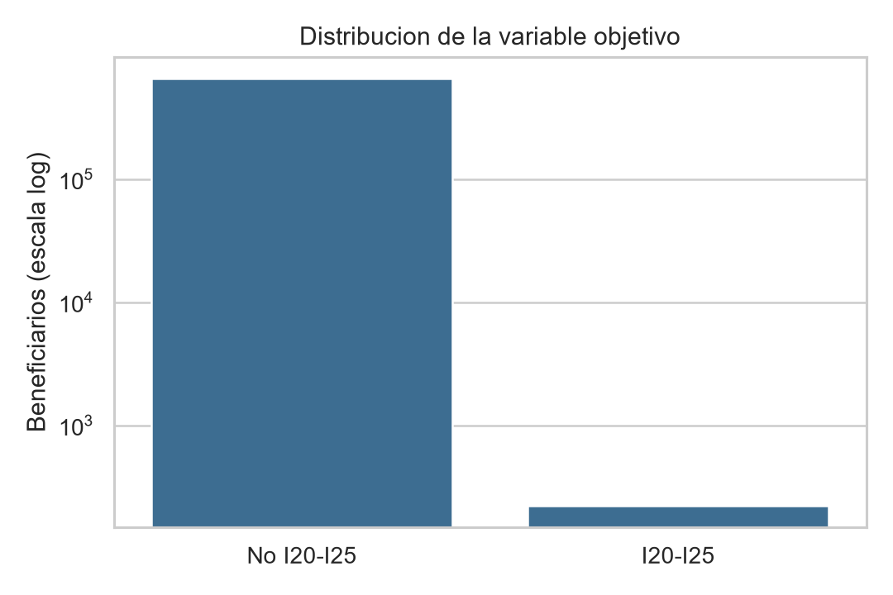
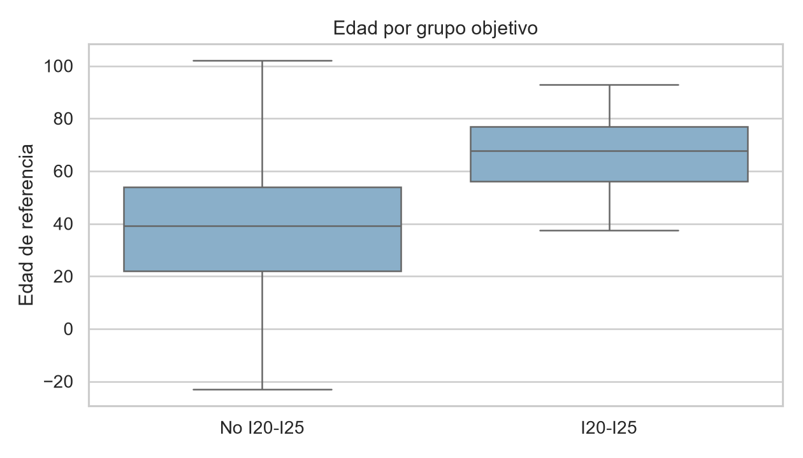
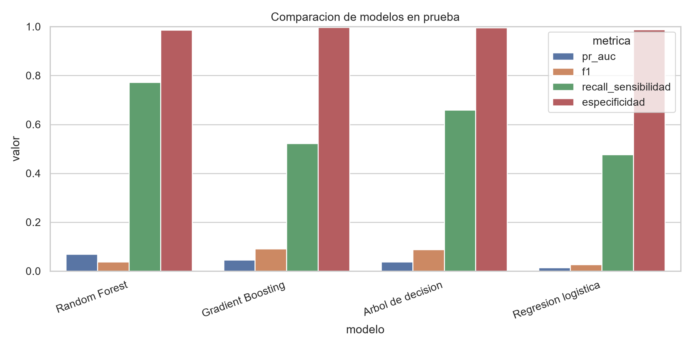
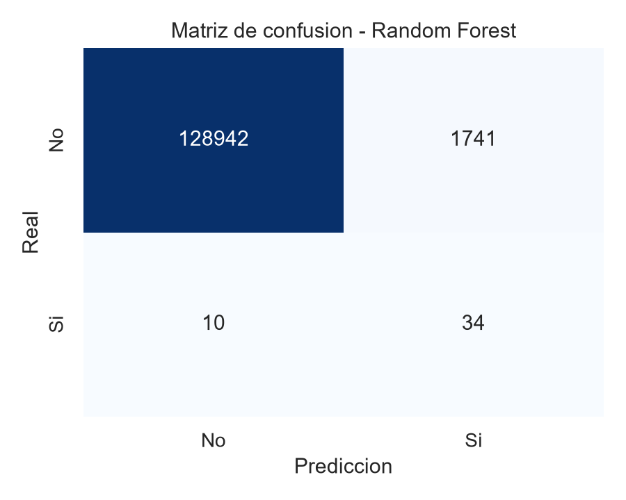
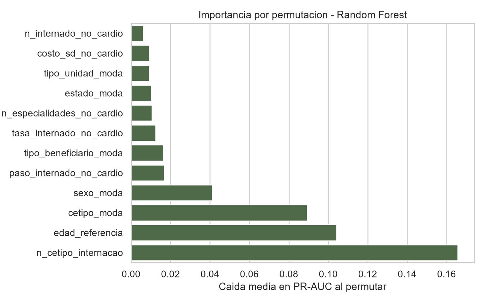
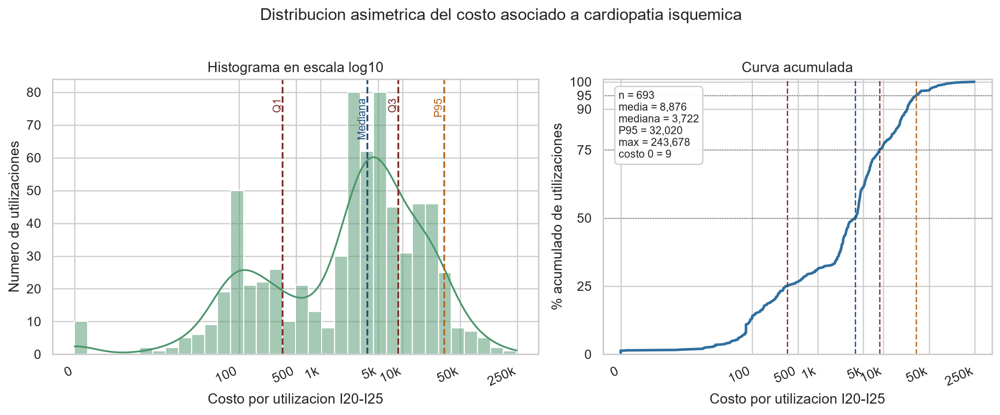

# Taller 3 - Minería de Datos

> Nota: la version de presentacion con tablas `kableExtra`, `kable_styling()` y `scale_down` esta en `taller_3.Rmd`. Este archivo queda como respaldo estatico en Markdown.

## Enfermedad seleccionada

La enfermedad seleccionada fue **cardiopatía isquémica**, definida mediante los códigos **CID I20-I25**. Según el navegador ICD-10 de la OMS, este bloque corresponde a enfermedades isquémicas del corazón e incluye diagnósticos como angina de pecho, infarto agudo de miocardio, complicaciones posteriores al infarto, otras formas agudas y cardiopatía isquémica crónica: [OMS ICD-10 Browser](https://icd.who.int/browse10/2016/en).

La elección es adecuada para el taller porque tiene una definición clínica coherente, costo total alto y suficientes registros asociados para estudiar costos. Al recalcular directamente sobre `db_2026.csv`, se encontraron **22.718 registros I20-I25**, **693 utilizaciones** y **222 beneficiarios positivos**. El resumen exploratorio previo reportaba 223 beneficiarios, pero la lectura directa de `CID` y `CHAVE_FUNCIONAL` sobre la base completa produjo 222.

## Variable objetivo

La variable objetivo se construyó a nivel de beneficiario:

-   `cardio_isquemica = 1` si el beneficiario tuvo al menos una transacción con `CID` entre `I20` e `I25`.
-   `cardio_isquemica = 0` en caso contrario.

No se usó `CID` como predictor. Además, para reducir fuga de información, las variables predictoras se agregaron excluyendo las filas con `CID I20-I25`; de esta forma, el modelo no aprende directamente de las mismas utilizaciones que definen la etiqueta.

## Descripción de la base

| Métrica                                 |                   Valor |
|-----------------------------------------|------------------------:|
| Registros                               |               9.345.278 |
| Beneficiarios                           |                 653.631 |
| Beneficiarios con cardiopatía isquémica |                     222 |
| Prevalencia                             |                 0,034 % |
| Registros I20-I25                       |                  22.718 |
| Utilizaciones totales                   |               2.250.307 |
| Utilizaciones I20-I25                   |                     693 |
| Periodo observado                       | 2026-01-01 a 2026-12-08 |

La variable objetivo está extremadamente desbalanceada. Esto hace que `accuracy` sea poco informativa: un modelo que predijera siempre la clase negativa tendría una exactitud cercana a 99,97 %, pero no identificaría ningún caso positivo. Por esta razón, la métrica principal fue **PR-AUC**, acompañada de F1, sensibilidad, especificidad y ROC-AUC.

## Calidad de datos

Se identificaron los siguientes problemas principales:

| Problema                                         |            Resultado |
|--------------------------------------------------|---------------------:|
| `CID` faltante o no informado                    | 86,95 % de registros |
| `DESC_ESPECIALIDADE` faltante                    |              70,50 % |
| Estado/unidad hospitalaria faltante              |              28,75 % |
| Fechas de utilización inválidas                  |                    0 |
| Fechas de nacimiento inválidas                   |                    0 |
| Beneficiarios con más de un sexo                 |                  525 |
| Beneficiarios con más de un tipo de beneficiario |                6.950 |
| Beneficiarios con más de una fecha de nacimiento |                    0 |

Para variables demográficas inconsistentes se usó la moda por beneficiario. También se conservaron variables auxiliares de inconsistencia, como número de sexos distintos y número de tipos de beneficiario distintos.

En `VALOR_UTILIZACAO` se observaron valores extremos y algunos valores negativos. El límite superior por regla IQR fue aproximadamente 176,65, con 690.963 registros por encima de ese límite y 3.001 valores negativos. En salud, los costos suelen ser muy asimétricos, por lo que estos valores se documentaron en lugar de eliminarlos automáticamente.

## Variables construidas

La tabla final quedó a nivel de `CHAVE_FUNCIONAL` con 653.631 beneficiarios y 37 columnas. Las variables predictoras incluyen:

-   Edad de referencia.
-   Sexo y tipo de beneficiario por moda.
-   Número de registros no I20-I25.
-   Número de utilizaciones no I20-I25.
-   Número de procedimientos distintos.
-   Costos acumulados, promedio, desviación, mínimo y máximo.
-   Indicadores y tasas de UCI e internación.
-   Conteos por tipo de utilización: consulta, examen, terapia, internación, pronto socorro y otros.
-   Especialidad, estado, tipo de unidad y tipo de utilización más frecuente.
-   Indicadores de inconsistencias demográficas.

## Modelamiento

Se compararon cuatro modelos:

1.  Regresión logística con `class_weight="balanced"`, como modelo interpretable.
2.  Árbol de decisión, como baseline interpretable.
3.  Random Forest, como modelo robusto para datos tabulares.
4.  Gradient Boosting, como modelo de mayor capacidad no lineal.

Dado el desbalance extremo, el entrenamiento usó todos los positivos del conjunto de entrenamiento y una muestra reproducible de negativos en razón 50:1. La evaluación final se hizo sobre un conjunto de prueba estratificado con la prevalencia natural de la base.

| Modelo              | PR-AUC | ROC-AUC |     F1 | Precisión | Sensibilidad | Especificidad |
|---------------------|-------:|--------:|-------:|----------:|-------------:|--------------:|
| Random Forest       | 0,0686 |  0,9683 | 0,0374 |    0,0192 |       0,7727 |        0,9867 |
| Gradient Boosting   | 0,0462 |  0,9619 | 0,0907 |    0,0497 |       0,5227 |        0,9966 |
| Árbol de decisión   | 0,0387 |  0,9113 | 0,0876 |    0,0469 |       0,6591 |        0,9955 |
| Regresión logística | 0,0145 |  0,9510 | 0,0269 |    0,0138 |       0,4773 |        0,9885 |

Usando PR-AUC como métrica principal, el mejor modelo fue **Random Forest**. Este modelo recuperó cerca del 77 % de los positivos del test, aunque con baja precisión debido a la rareza de la enfermedad. Si el objetivo fuera reducir falsos positivos, Gradient Boosting sería una alternativa más conservadora, con mayor F1 y precisión.

## Interpretación

La regresión logística aporta una lectura interpretable de asociaciones lineales después del preprocesamiento. Entre las variables con coeficientes altos aparecieron especialidades asociadas a cardiología, tipo de utilización e indicadores de internación. Sin embargo, los coeficientes deben interpretarse con cautela porque el entrenamiento usa submuestreo de negativos y porque algunas categorías pueden actuar como proxies de severidad o acceso al servicio.

En Random Forest, la importancia por permutación mostró como variables principales:

-   Número de internaciones no I20-I25.
-   Edad de referencia.
-   Tipo de utilización más frecuente.
-   Sexo.
-   Indicadores y tasas de internación.
-   Número de especialidades consultadas.

Estos resultados son clínicamente razonables: la cardiopatía isquémica se asocia con mayor edad, mayor intensidad de uso del sistema y eventos de mayor complejidad como internaciones.

## Estimación de costos

La unidad de análisis para el costo fue la **utilización**, aproximada por la combinación `CHAVE_FUNCIONAL + DT_UTILIZACAO`. Esta decisión evita contar varias veces una misma atención cuando una utilización tiene múltiples procedimientos.

Para utilizaciones asociadas a `CID I20-I25`:

| Métrica                        |        Valor |
|--------------------------------|-------------:|
| Utilizaciones                  |          693 |
| Costo total                    | 6.151.092,29 |
| Costo promedio por utilización |     8.876,04 |
| Mediana                        |     3.721,78 |
| Q1                             |       344,14 |
| Q3                             |     8.816,38 |
| P95                            |    32.020,32 |
| Máximo                         |   243.678,10 |

La distribución de costos es fuertemente asimétrica y presenta una cola derecha larga. Por eso la figura se presenta en escala `log10(costo + 1)` y se complementa con una curva acumulada. La mediana se ubica alrededor de 3.722, mientras que el percentil 95 llega a 32.020 y el máximo alcanza 243.678. Esto muestra que la mayoría de las utilizaciones se concentra en valores bajos o intermedios, pero un grupo pequeño de eventos de alto costo eleva de forma importante la media.

## Conclusiones

La cardiopatía isquémica fue una buena elección para el taller porque tiene una definición CID clara, relevancia clínica y costo total importante. No obstante, la prevalencia a nivel de beneficiario fue extremadamente baja: 222 positivos entre 653.631 beneficiarios. Esto convierte el problema en una tarea de detección de eventos raros.

El mejor modelo por PR-AUC fue Random Forest. Su desempeño en ROC-AUC fue alto, pero la precisión fue baja, lo cual es esperable con una prevalencia de 0,034 %. Por tanto, el modelo es más útil como herramienta de priorización o tamizaje que como clasificador definitivo.

Las variables más relacionadas con la predicción fueron edad, internación, tipo de utilización, costos agregados y especialidades. Estos patrones son consistentes con una enfermedad cardiovascular de mayor complejidad clínica.

## Limitaciones

-   La base tiene muchos registros sin CID, lo que puede subestimar la enfermedad.
-   La clase positiva es extremadamente pequeña.
-   La estrategia excluye filas I20-I25 para reducir fuga, pero no garantiza temporalidad causal.
-   El entrenamiento usó submuestreo de negativos por eficiencia y balance.
-   No se hizo validación externa.
-   Los modelos no deben interpretarse causalmente.
-   Los costos tienen alta asimetría, valores extremos y algunos valores negativos.

## Trabajos futuros

-   Construir un split temporal para predecir eventos futuros.
-   Calibrar probabilidades con un conjunto de validación.
-   Probar XGBoost o LightGBM con `scale_pos_weight`.
-   Usar SHAP para explicación local y global.
-   Incorporar grupos de comorbilidades no I20-I25.
-   Validar reglas de codificación clínica con una fuente médica o administrativa.
